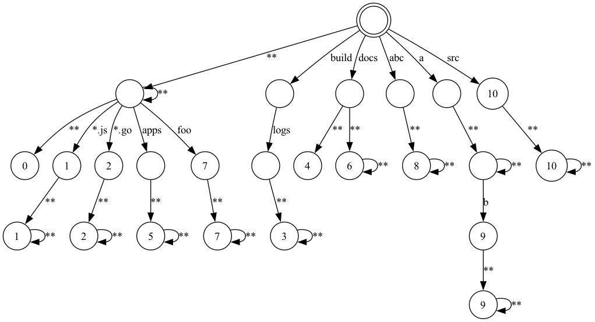

# CODEOWNERS

This provides a parser and a set of matchers for
the [CODEOWNERS file format](https://docs.github.com/en/repositories/managing-your-repositorys-settings-and-features/customizing-your-repository/about-code-owners).

## Installation

via [Composer](https://getcomposer.org/)

```bash
composer require kellegous/codeowners
```

## Usage

### SimpleMatcher

The [SimpleMatcher](src/SimpleMatcher.php) is a straight-forward implementation of a [RuleMatcher](src/RuleMatcher.php)
that can find the relevant pattern for a file path in `O(N)` time relative to the number of rules in the `CODEOWNERS`
file.

```php
$owners = Owners::fromFile('.github/CODEOWNERS');
$matcher = new SimpleMatcher($owners->getRules());
$rule = $matcher->match($relative_path);
```

### AutomataMatcher

The [AutomataMatcher](src/AutomataMatcher.php) is a more complex implementation of a [RuleMatcher](src/RuleMatcher.php)
that requires a bit more memory that the `SimpleMatcher` but is able to do matching in `O(log N)` time relative to the
number of rules in the `CODEOWNERS` file.

```php
$owners = Owners::fromFile('.github/CODEOWNERS');
$matcher = AutomataMatcher::build($owners->getRules());
$rule = $matcher->match($relative_path);
```

#### What does the AutomataMatcher do?

Each of the patterns in a `CODEOWNERS` rule is a simplified regular expression and, thus, it could be represented as a
fininte automata. In fact, the `SimpleMatcher` turns each of the patterns into a regular expression and then iteratively
matches the path against those regular expressions. In other words, the `SimpleMatcher` executes the finite automata
of each rule independently. The `AutomataMatcher`, on the other hand, combines all of the patterns into a single finite
automata. For example, here is the state machine for Github's [exmaple CODEOWNERS](tests/CODEOWNERS.example).



The image was rendered with the following command:

```bash
bin/render-nfa tests/CODEOWNERS.example | dot -Tpng -o tests/CODEOWNERS.example.png
```

## Acknowledgements

The code in `SimpleMatcher` that converts patterns to regular expressions owes a debt of gratitude
to https://github.com/hmarr/codeowners.

## Author(s)

- [Kelly Norton](https://github.com/kellegous)
